# pytest 実行フロー — どのファイルが呼ばれるか

`pytest tests/test_lambda_function.py` を実行したときに、どのPythonファイルがどの順番で
読み込まれ、呼び出されるかをまとめます。

## 登場するファイル

| ファイル | 役割 |
|---|---|
| `tests/test_lambda_function.py` | テストコード本体。偽の `boto3` を用意してから `lambda_function` を読み込む |
| `lambda_function.py` | テスト対象。`import boto3` している |
| `boto3`（本物） | **一度も読み込まれない**。`sys.modules` に偽物を先に登録することで読み込みをブロックしている |

## 全体の流れ

```mermaid
flowchart TD
    A["pytest tests/test_lambda_function.py を実行"] --> B["収集フェーズ<br/>tests/ 配下の test_*.py を探索"]
    B --> C["test_lambda_function.py を<br/>モジュールとして import開始"]

    C --> D1["① sys, types, importlib,<br/>unittest.mock を import"]
    D1 --> D2["② 偽の boto3 モジュールを作成し<br/>sys.modules['boto3'] に登録"]
    D2 --> D3["③ lambda_function.py を import"]

    D3 --> E1["lambda_function.py 内の<br/>import boto3 が実行される"]
    E1 --> E2{"sys.modules に<br/>boto3 は登録済み？"}
    E2 -->|"Yes（②で登録済み）"| E3["本物の boto3 ではなく<br/>偽の boto3 を読み込む"]
    E3 --> F["lambda_function.py の<br/>import が完了"]

    F --> G["test_lambda_function.py の<br/>import が完了<br/>（test_* 関数を収集）"]
    G --> H{"各テスト関数を順に実行"}
    H --> I["patch.object で<br/>lambda_function.boto3.client を<br/>モックに差し替え"]
    I --> J["lambda_function.lambda_handler&#40;&#41;<br/>を呼び出す"]
    J --> K["assert で結果を検証"]
    K --> H
    H -->|"全テスト終了"| L["結果を集計してレポート表示"]

    classDef file fill:#2c5fa0,stroke:#2c5fa0,color:#ffffff;
    class D3,E1,J file
```

## ポイント

- **`boto3`（本物）は一度もimportされません。** `test_lambda_function.py` が `lambda_function.py` より
  先に、偽の `boto3` を `sys.modules["boto3"]` に登録してしまうため、`lambda_function.py` の
  `import boto3` はこの偽物を掴みます。ネットワークに繋がずにテストできるのはこの仕組みのためです。
- **import されるのは1回だけ**です。`import lambda_function` はテストファイルの先頭（モジュールレベル）で
  1回だけ実行され、以降の各テスト関数からは `lambda_function.lambda_handler(...)` として
  同じモジュールを使い回します。
- **`lambda_handler` が実際に呼ばれるのはテスト関数の中だけ**です。3つのテスト関数
  （`test_returns_200_with_object_content` / `test_returns_500_when_connection_fails` /
  `test_returns_400_when_bucket_or_key_missing`）が、それぞれ1回ずつ `lambda_handler` を呼び出します。

テストケースの内容自体は [`tests/README.md`](../tests/README.md) を、
デバッグ時の挙動については [`docs/debugging.md`](debugging.md) を参照してください。
